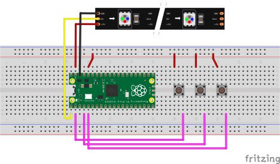
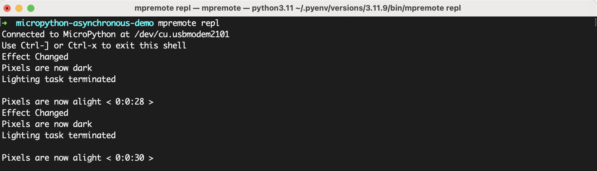
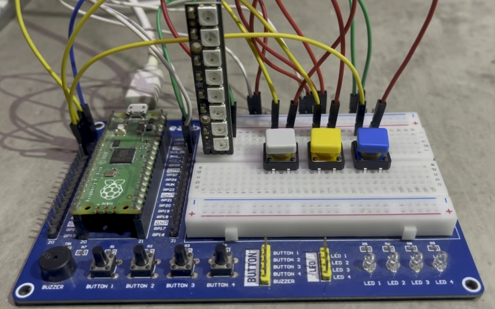

# Pi Pico Asynchronous NeoPixels



## Overview

This demonstration shows how to use a Raspberry Pi Pico to control various
aspects of a bar, ring, or strip of NeoPixels using common controls such as buttons.
Specifically, how to adjust the brightness, timing, and effect of the connected NeoPixels.

### Resources

The following resources were instrumental to this project

[Adafruit NeoPixel Überguide](https://learn.adafruit.com/adafruit-neopixel-uberguide/python-circuitpython)  
[Micropython Asyncio](https://github.com/peterhinch/micropython-async/blob/master/v3/docs/TUTORIAL.md)

## Prerequisites

Before you begin, ensure you have these, or similar parts, nearby:

- [Raspberry Pi Pico](https://www.digikey.com/en/products/detail/raspberry-pi/SC0915/13624793)
- [Adafruit NeoPixels Stick](https://www.digikey.com/en/products/detail/adafruit-industries-llc/1426/5395892)
- [Adafruit Colorful Buttons](https://www.digikey.com/en/products/detail/adafruit-industries-llc/1010/7244937)

***Pi Pico W can also be used***  
***Any Adafruit NeoPixel component should be usable. I used a stick for simplicity***

## Setup

### Preparing Pico

Install version **Micropython 1.23.0**, or later, onto the device. This example uses methods of the ***deque*** class
that may not exist in earlier versions.

[Installing Micropython](https://www.raspberrypi.com/documentation/microcontrollers/micropython.html)

### Connecting Components


Connect everything as above in the *Fritzing* diagram, if using linked components. You may need to solder header pins
to the NeoPixels to connect to a breadboard. If this is not possible, then alligator cables
should suffice.

### Modifying Source Code

If you choose to use NeoPixel's that are `RGBW`, instead of `RGB`, then one small change in the source
code is required for optimal operation

Inside `hardware.py`, change the value of the `__RGB` variable in the `Output` class to `False`

```python
class Output:
    ___RGB = False  # Only False if using RGBW NeoPixels
```

### Uploading Source Code

Upload all the required files to Pi Pico's root directory.

`lib/`  
`hardware.py`  
`lighting.py`  
`main.py`

This can be easily accomplished using the application `Thonny`, or other tools such as
`mpremote` or `rshell`.

*The `lib/` directory is especially important since it contains modules used by the demonstration.*

### REPL

If everything went well, interacting with the device should produce similar output into the terminal:



A live demonstration can be seen below:

[](./assets/demo.mp4)

## Troubleshooting
